# RECOVERAI

RECOVERAI is a working hackathon prototype for AI-assisted digital evidence recovery. It analyzes uploaded binary evidence, records what is actually observed, estimates recovery feasibility, and only creates a downloadable recovery artifact when the output is independently byte-verifiable.

It is designed for the CALMSTACKS 24H Hackathon cybersecurity and AI track.

## What the prototype does

- Creates a traceable investigation and imports an evidence file with SHA-256 provenance.
- Scans binary signatures and basic format structure for PDF, JPEG, PNG, GIF, ZIP, PE, and ELF evidence.
- Splits evidence into fixed-size blocks, calculates entropy and byte-composition features, and assigns an explainable fragment classification and confidence score.
- Scores neighboring fragment relationships using physical offset continuity, type compatibility, entropy similarity, and classification compatibility.
- Displays observed, missing, reconstructed, and uncertain regions in a damage map.
- Makes a conservative recovery assessment. Normal uploads without independent source material do **not** receive invented bytes or a fake download.
- Restores the included controlled damaged-PDF benchmark only after exact SHA-256 matching to its documented damaged input and trusted original. The resulting download is copied from ground truth and verified byte-for-byte; it is visibly labelled as a controlled benchmark result.

## Forensic guardrails

| Situation | RECOVERAI result |
| --- | --- |
| Bytes have independent ground truth and recovered hash matches it | `VERIFIED RECOVERY` |
| A structurally valid upload has no known missing region | `NO RECOVERY REQUIRED` |
| Structure can be assessed but bytes are missing | `STRUCTURAL REPAIR` or `PLAUSIBLE RECONSTRUCTION` |
| Evidence cannot support original missing bytes | `INSUFFICIENT EVIDENCE` and no download |
| Any inference is ever introduced | It must be labelled `INFERRED — NOT VERIFIED ORIGINAL DATA` |

RECOVERAI never presents AI-generated content as original evidence.

## Architecture

```mermaid
flowchart LR
  U[Investigator] --> I[React evidence intake]
  I -->|investigation + multipart upload| A[FastAPI]
  A --> H[SHA-256 + SQLite provenance]
  H --> S[Signature & structure scan]
  S --> F[Block fragment detection]
  F --> C[Explainable feature classifier]
  C --> R[Relationship scoring]
  R --> D[Damage / feasibility assessment]
  D --> V[Structural validation]
  V -->|exact benchmark only| G[Ground-truth recovery & hash comparison]
  V -->|all other evidence| N[No unverifiable output]
  G --> E[Evidence, fragments, damage map & report]
  N --> E
```



The technical breakdown and API contract are in [docs/architecture.md](docs/architecture.md). The judge-ready demonstration sequence is in [docs/demo-runbook.md](docs/demo-runbook.md).

## Run locally

Requirements: Node.js 20+ and Python 3.12+.

```powershell
# Terminal 1: API, first-time setup
cd backend
py -3.12 -m venv .venv
.\.venv\Scripts\python.exe -m pip install -r requirements.txt
.\.venv\Scripts\python.exe -m uvicorn app.main:app --reload --port 8000
```

If the checkout already has `backend/.venv`, only the final command is needed. If the `py` launcher is unavailable, use the path to any installed Python 3.12+ executable in the first command.

```powershell
# Terminal 2: web application
cd frontend
npm install
npm run dev
```

Open the Vite URL shown in the second terminal, normally `http://127.0.0.1:5173`.

## Controlled benchmark demo

1. Open **New Investigation**.
2. Upload `data/benchmark/damaged/Mr (1)_damaged.pdf`.
3. Continue to **Analysis** and wait for all pipeline stages to complete.
4. Open **Recovered Evidence** to see the controlled-ground-truth notice, before/after comparison, damage map, and SHA-256 comparison.
5. Use **Download Verified File**. It is available only for the exact benchmark input and produces `verified_Mr (1)_original.pdf`.

The benchmark metadata documents a 4,096-byte removal from offsets 90,000–94,095. Those values are shown as ground truth, never as independently inferred forensic findings.

## Verification

```powershell
cd frontend
npm run lint
npm run build
```

After starting the API, use `http://127.0.0.1:8000/api/health` to confirm the backend. The full backend test commands and endpoint sequence are in the demo runbook.
