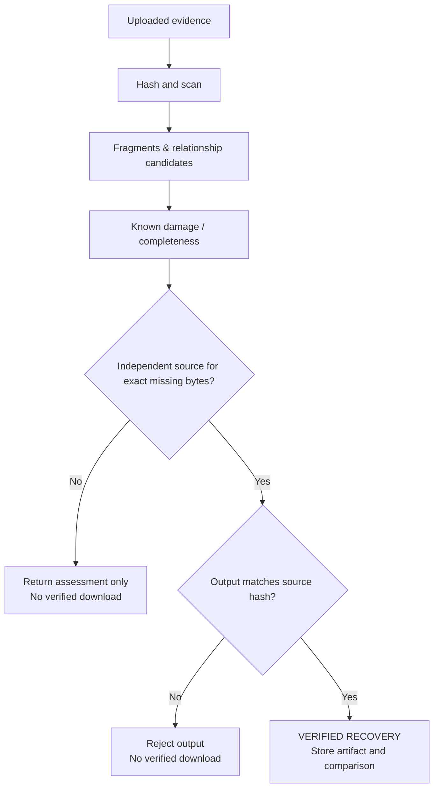

# RECOVERAI technical architecture

## System layers

| Layer | Responsibility | Output that can be reviewed |
| --- | --- | --- |
| React/Vite client | Intake, pipeline progress, evidence review, reports | No mock evidence values; data is rendered from FastAPI responses saved for the selected evidence item |
| FastAPI API | Investigation, upload, analysis, reconstruction, download endpoints | JSON responses and controlled failure messages |
| SQLite / storage | Evidence metadata, fragment records, relationships, damage regions, reconstruction candidates | SHA-256-linked provenance and persistent analysis records |
| Scanner | Magic-byte detection, entropy, header/footer structural markers | File type candidates, signature locations, structural facts |
| Fragment intelligence | 4 KiB fragments, content features, confidence | Offset, size, hash, entropy, probable type, classification, confidence |
| Relationship engine | Neighbor graph candidate scoring | Offset gap, relationship score and specific support signals |
| Feasibility / validation | Completeness, damage, structure, recovery confidence | Conservative status and explicitly missing regions |
| Controlled benchmark adapter | Exact SHA-256 match to local damaged and original corpus | Byte-identical recovery artifact and independently reproducible comparison |

## Analysis model

RECOVERAI uses an explainable feature model rather than a black-box recovery claim. Each 4 KiB block is assessed from observed properties:

- validated preceding signature and probable format;
- Shannon entropy;
- printable, zero, and high-bit byte proportions;
- structural markers appropriate for the detected container.

The classifier returns a category such as structural/data, sparse, text-like, binary, or unknown plus a bounded confidence score. A confidence score means feature compatibility, **not** proof that a fragment came from a particular original file.

Each neighboring pair becomes a graph edge candidate. Its score is a weighted combination of physical offset continuity (40%), type compatibility (25%), entropy similarity (20%), and classification compatibility (15%). The UI says these are relationship candidates rather than evidence of origin.

## Recovery decision model

The current independent source mechanism is deliberately limited to the included controlled benchmark. It requires:

1. an uploaded file whose SHA-256 exactly equals the documented damaged benchmark hash;
2. a local original whose SHA-256 equals the documented original hash; and
3. a recovered artifact whose SHA-256 equals that original hash.

An ordinary upload can be scanned and assessed, but cannot become a verified recovered file merely because its file type looks valid.
An intact, structurally valid upload is marked `NO RECOVERY REQUIRED`; RECOVERAI reserves `VERIFIED RECOVERY` for a separately produced output that passes independent hash verification.

## API contract

| Method | Route | Purpose |
| --- | --- | --- |
| `POST` | `/api/investigations/` | Create a named investigation |
| `POST` | `/api/evidence/upload?investigation_id={id}` | Save uploaded evidence and calculate provenance hash |
| `POST` | `/api/analysis/{evidence_id}/scan` | Scan, fragment, classify, relate and record results |
| `GET` | `/api/analysis/{evidence_id}/results` | Return persisted fragments and relationships without re-scanning |
| `GET` | `/api/analysis/{evidence_id}/damage-map` | Return visual damage-map facts and regions |
| `POST` | `/api/reconstruction/{evidence_id}` | Assess recovery, validate structure, and create a verified benchmark artifact only when allowed |
| `GET` | `/api/reconstruction/{evidence_id}/download` | Download a verified artifact; returns HTTP 409 if none exists |
| `GET` | `/api/health` | Confirm API, storage and database readiness |

## Traceability

Every evidence record retains the original filename, internal stored filename, acquisition time, SHA-256, MIME/type detection result, status, and investigation ID. Fragment and relationship records reference the evidence ID. Damage regions carry a source label. A `GROUND_TRUTH` source is explicitly presented as controlled benchmark metadata rather than forensic discovery.

## Current supported evidence boundaries

This is a prototype, not a replacement for validated forensic tooling. It provides basic container-marker validation and feature analysis; it does not parse every format’s internal object graph or claim deleted-file recovery from unallocated disk sectors. Its strongest demonstration is the documented controlled PDF recovery path, where every recovered byte is independently verified.
